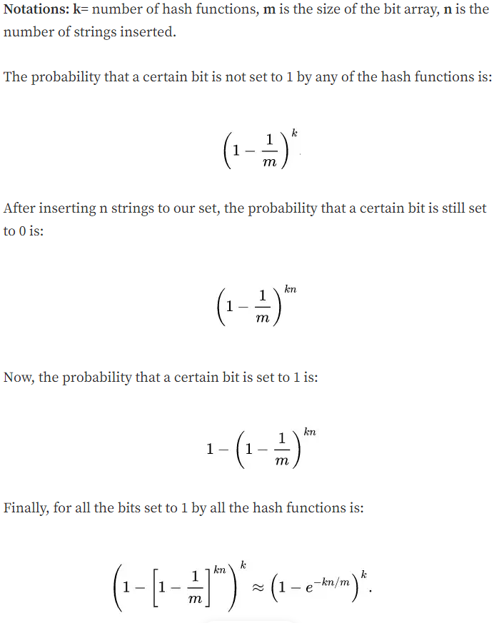
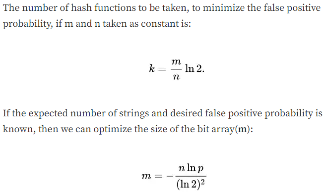

# Bloom Filter implementation in Go 

### What is Bloom Filter?
A bloom filter is a probabilistic data structure based on hashing that is extremely space efficient and has various use cases like prevention of searching elements that don't exist in a database.

### How does it work?

>Bloom filter acts almost similar to hashmaps, if a value has to be stored in a database, it is hashed using k different hashing algorithms. The checkSum returned from these hash algos is then truncated/modded according to the size of the byteArray which can now act as the index of that array.
The bits at index are then set to 1, otherwise go initializes all the variables with zero values that is 0. And then the value is stored in the database.
 
 
>To check if a value exists in the database, the value is again hashed using the same 3 algorithms with same seed (if any using seed values) to obtain the indices to check if the value was set according to it. If all the k indices were set to 1 then there's a high probability that the element to be searched exists. 
 
 
> However if any of the index is not set then it is a 100% assurance that the element does not exist.
>     
 
 
> In order to hash efficiently Go-Routines and WaitGroups have been used. 